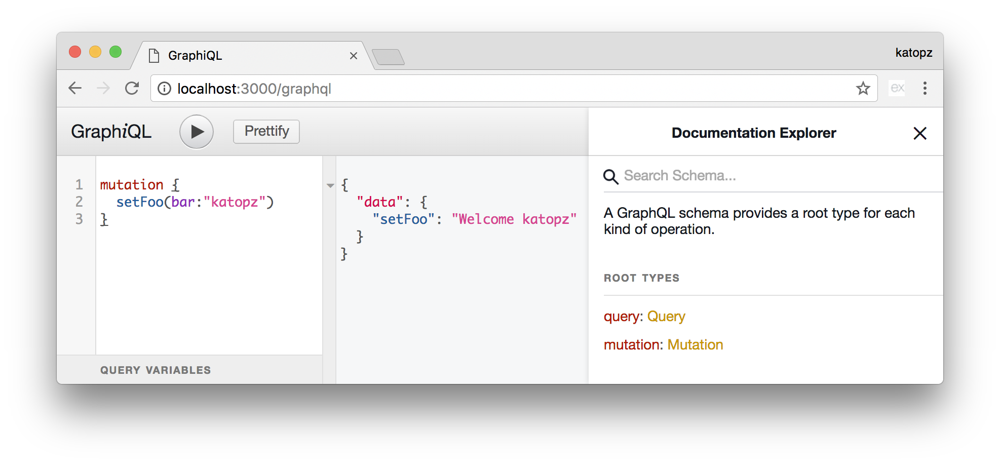

# nap
[WIP] NextJS/Apollo/PassportJS


## Stacks
```
Docker
├─ Nginx ["/etc/nginx/sites-enabled", "/etc/nginx/certs", "/etc/nginx/conf.d", "/var/log/nginx", "/var/www/html"]
├─ NodeJS 7.5
│  ├─ NextJS ["/app"]
│  ├─ Apollo GraphQL ["/graphql"]
│  └─ PassportJS ["/vendors"]
├─ Redis ["/data"]
└─ MongoDB ["/data/db"]
```

## Config
```shell
cp .env.example .env
```
Then fill up `.env` file. e.g.
```shell
# This is fake id, use your own!
FACEBOOK_APP_ID=213587919136550
FACEBOOK_APP_SECRET=249ac8dcc38afe95decf442fc4e63ec8
```

## Passport
You'll need to config `Redis` endpoint at `.env`
```shell
# For localhost standalone dev
REDIS_STORE_URI=redis://redis:6379
```
### To login with Facebook
- http://localhost:3000/auth/facebook/

## Develop
```shell
# To build docker compose
docker-compose build

# To run via docker compose
docker-compose up -d

# Open browser (Stop other localhost services first)
open http://localhost:3000/
```

# GraphQL

```
# Query
{
  pets(name: "katopz") {
    id
    name
  }
}

# Mutation
mutation{
  addPet(input:{name:"katopz", type: "B", age: 11}) {
    viewer {
      pets(name:"katopz") {
        edges {
          node {
            id
            name
          }
        }
      }
    }
  }
}
```

## Stacks
- [x] [`next`](https://github.com/zeit/next.js/) for SSR `React`.
- [x] [`apollo`](https://github.com/apollographql) for `GraphQL` client.
- [x] [`passport`](https://github.com/jaredhanson/passport) for `Express` authentication.

## Extras
- [x] [`express`](https://github.com/expressjs/express) for web framework.
- [x] [`express-session`](https://github.com/expressjs/session) for persist session via `Redis`.
- [x] [`graffiti-mongoose`](https://github.com/RisingStack/graffiti-mongoose) for auto schema `GraphQL` from `MongoDB`.
- [x] [`nginx`](https://github.com/nginxinc) for proxy.

## TODO
- [ ] Add [Swarm mode stack](https://gist.githubusercontent.com/katopz/e4d5cf402a53c4a002a657c4c4f67a3f/raw/077ac9057c789f49a366563941dd749827d52e3d/setup-swarm-stack.sh)
- [ ] Add `Nginx` container.
- [ ] Add HTTPS https://github.com/vfarcic/docker-flow-stacks/blob/master/ssl/README.md
- [ ] Add logs.
- [ ] Add email/pass user.
- [ ] Link user with social.
- [ ] Add https://github.com/apollographql/graphql-subscriptions

## TOTEST
- [ ] Redis fail test.
- [ ] HTTP fail test.
- [ ] HTTPS fail test.

## TOCUSTOM
- [ ] Custom app, Ensure ES6 with vscode debug working.
- [ ] Custom schema, Ensure `graphql-tools`.
- [ ] Custom DB, orm, MongoDB `docker exec -it node1 mongo --eval "rs.initiate()"`
- [ ] [Run Multiple Docker Environments (qa, stage, prod) from the Same docker-compose File.](http://staxmanade.com/2016/07/run-multiple-docker-environments--qa--beta--prod--from-the-same-docker-compose-file-/)
- [ ] Add passport github.
- [ ] HTTPS with https://github.com/expressjs/session#cookiesecure
- [ ] Redis : https://hub.docker.com/_/redis/
- [ ] MongoDB : https://hub.docker.com/_/mongo/

## TOHAVE
- [ ] Volume `./app` as data container?
- [ ] Volume file `./graphql/schema.js`?
- [ ] Use base-image? https://github.com/phusion/passenger-docker
- [ ] Use yo man gen passport vendors
- [ ] RabbitMQ?
- [ ] Notifications or maybe use vendors with webtask.
- [ ] GraphQL subscriptions.
- [ ] GraphQL advance examples.
- [ ] yarn? https://github.com/kriasoft/nodejs-api-starter/blob/master/docker-compose.yml#L18
- [ ] Fallback for `Redis` session store.
- [ ] Add MongoDB replica set/sharding? https://github.com/sisteming/mongodb-swarm
- [ ] GraphQL MongoDB query projection https://github.com/RisingStack/graphql-server
- [ ] Cache MongoDB with Redis https://www.npmjs.com/package/mongoose-redis-cache
- [ ] Add [graphql-sequelize](https://github.com/mickhansen/graphql-sequelize)
- [ ] Notifications Support.
- [ ] Hook Support.
- [ ] Admin Dashboard with `SSH`.
- [ ] Authen with mobile via [`Digits`](https://docs.fabric.io/web/digits/overview.html)
- [ ] Cron with `webtask.io`.
- [ ] `graffiti` simple API