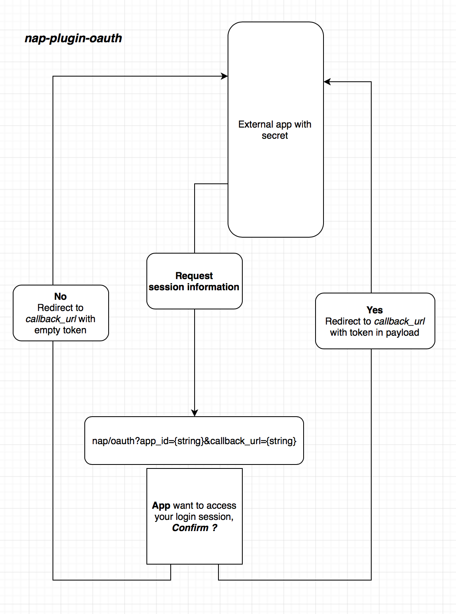

## Usage

### Typescript
```ts
// in server side
type NAPContext = {
    app: expressApp,
    config: any,
    nextjs: nextjsApp
}
require('nap-plugin-oauth').init(context: NAPContext)

// in /pages/oauth.js
import PermissionConfirm from '../lib/nap-plugin-oauth/ui/PermissionConfirm'
export default PermissionConfirm
```

### Javascript
```js
// in server side
require('nap-plugin-oauth').init(context)

// in /pages/oauth.js
import PermissionConfirm from '../lib/nap-plugin-oauth/ui/PermissionConfirm'
export default PermissionConfirm
```

then go to `localhost:8080/oauth?app_id={string}&callback_url={string}`

